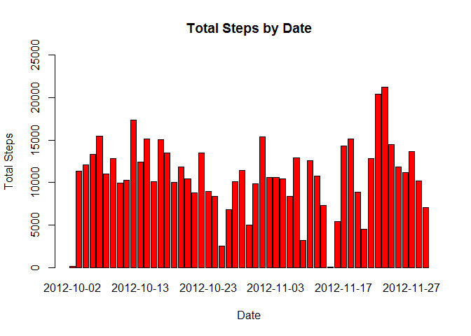
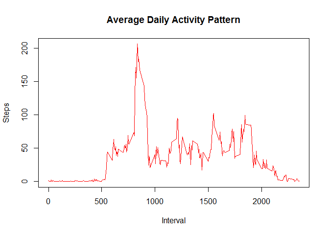
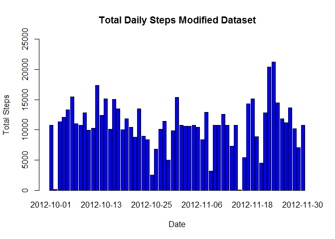
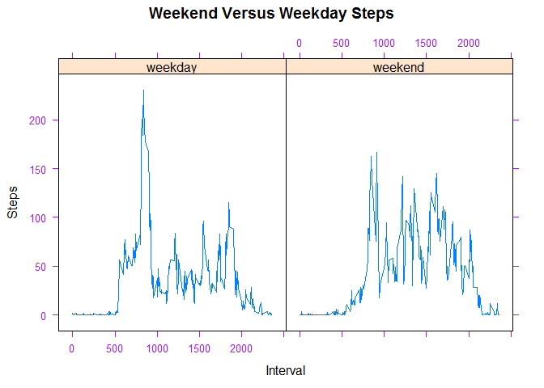

Reproducible Research: Peer Assessment 1
================

Read the data from /repdata-data-activity/activity.csv
------------------------------------------------------

``` r
activity <- read.csv("./repdata-data-activity/activity.csv", header = TRUE, colClass = c('integer', 'Date', 'integer'))
```

What is mean total number of steps taken per day?
-------------------------------------------------

``` r
attach(activity)
```

    ## The following objects are masked from activity (pos = 4):
    ## 
    ##     date, interval, steps

``` r
stepsbydate <- aggregate(steps ~ date, activity, na.rm=TRUE, sum)
head(stepsbydate)
```

    ##         date steps
    ## 1 2012-10-02   126
    ## 2 2012-10-03 11352
    ## 3 2012-10-04 12116
    ## 4 2012-10-05 13294
    ## 5 2012-10-06 15420
    ## 6 2012-10-07 11015

Barplot of the total steps taken per day
----------------------------------------

``` r
barplot(stepsbydate$steps, names.arg = stepsbydate$date, ylim=c(0, 25000), 
        xlab="Date", ylab="Total Steps", col = "red", main = "Total Steps by Date")
```

<!-- -->

Calculate and print mean and median number of steps
---------------------------------------------------

``` r
mean_steps <- mean(stepsbydate$steps, na.rm = TRUE)
print(mean_steps)
```

    ## [1] 10766.19

``` r
median_steps <- median(stepsbydate$steps, na.rm = TRUE)
print(median_steps)
```

    ## [1] 10765

What is the average daily activity pattern?
-------------------------------------------

``` r
stepsInterval <- aggregate(steps ~ interval, activity, mean)

plot(stepsInterval, type='l', main = "Average Daily Activity Pattern", col = "red",
     xlab="Interval", ylab="Steps")
```

<!-- -->

On average across all the days in the dataset, the 5-minute interval contains the maximum number of steps?
----------------------------------------------------------------------------------------------------------

``` r
maxsteps <- stepsInterval$interval[which.max(stepsInterval$steps)]

print(maxsteps)
```

    ## [1] 835

Calculate missing values in the data set
----------------------------------------

There are many days/intervals where there are missing values (coded as `NA`). The presence of missing days may introduce bias into some calculations or summaries of the data.

``` r
missingSteps <- sum(is.na(activity$steps))

print(missingSteps)
```

    ## [1] 2304

Replace each missing value with the mean value of its 5-minute interval
-----------------------------------------------------------------------

``` r
activityNew <- activity
nas <- is.na(activityNew$steps)
stepInterval <- tapply(activityNew$steps, activityNew$interval, mean, na.rm=TRUE, simplify=TRUE)
activityNew$steps[nas] <- stepInterval[as.character(activityNew$interval[nas])]

sum(is.na(activityNew$steps)) ## Verify that there are no missing values
```

    ## [1] 0

Make a histogram of the total number of steps taken each day and calculate the mean and median total number of steps (including adding the missing values from above).
----------------------------------------------------------------------------------------------------------------------------------------------------------------------

``` r
allSteps <- aggregate(steps ~ date, activityNew, sum)

barplot(allSteps$steps, names.arg = allSteps$date, ylim=c(0, 25000), col = "blue", 
        xlab="Date", ylab="Total Steps", main = "Total Daily Steps Modified Dataset")
```

<!-- -->

Mean and median values are higher after imputing missing data. The reason is that in the original data, there are some days with `steps` values `NA` for any `interval`. The total number of steps taken in such days are set to 0s by default. However, after replacing missing `steps` values with the mean `steps` of associated `interval` value, these 0 values are removed from the histogram of total number of steps taken each day.

Mean and median of the steps taken per day with new dataset
-----------------------------------------------------------

``` r
mean(allSteps$steps)
```

    ## [1] 10766.19

``` r
median(allSteps$steps)
```

    ## [1] 10766.19

Are there differences in activity patterns between weekdays and weekends? Using new dataset.
--------------------------------------------------------------------------------------------

First figure out which are weekdays and which are weekends.

``` r
typeofDay <- function(dates) {
  f <- function(date) {
    if (weekdays(date) %in% c("Saturday", "Sunday")) {
      "weekend"
    }
    else {
      "weekday"
    }
  }
  sapply(dates, f)
}

activityNew$typeofDay <- as.factor(typeofDay(activityNew$date))
str(activityNew)
```

    ## 'data.frame':    17568 obs. of  4 variables:
    ##  $ steps    : num  1.717 0.3396 0.1321 0.1509 0.0755 ...
    ##  $ date     : Date, format: "2012-10-01" "2012-10-01" ...
    ##  $ interval : int  0 5 10 15 20 25 30 35 40 45 ...
    ##  $ typeofDay: Factor w/ 2 levels "weekday","weekend": 1 1 1 1 1 1 1 1 1 1 ...

Panel plot comparing the average number of steps taken per 5-minute interval across weekdays and weekends using activityNew data.
---------------------------------------------------------------------------------------------------------------------------------

``` r
library(lattice)

allstepsInterval <- aggregate(steps ~ interval + typeofDay, activityNew, mean)

xyplot(steps ~ interval | typeofDay, scales=list(cex=.8, col="purple"), data=allstepsInterval, layout=c(2,1), type='l', xlab = "Interval", ylab = "Steps", main = "Weekend Versus Weekday Steps")
```

<!-- -->
